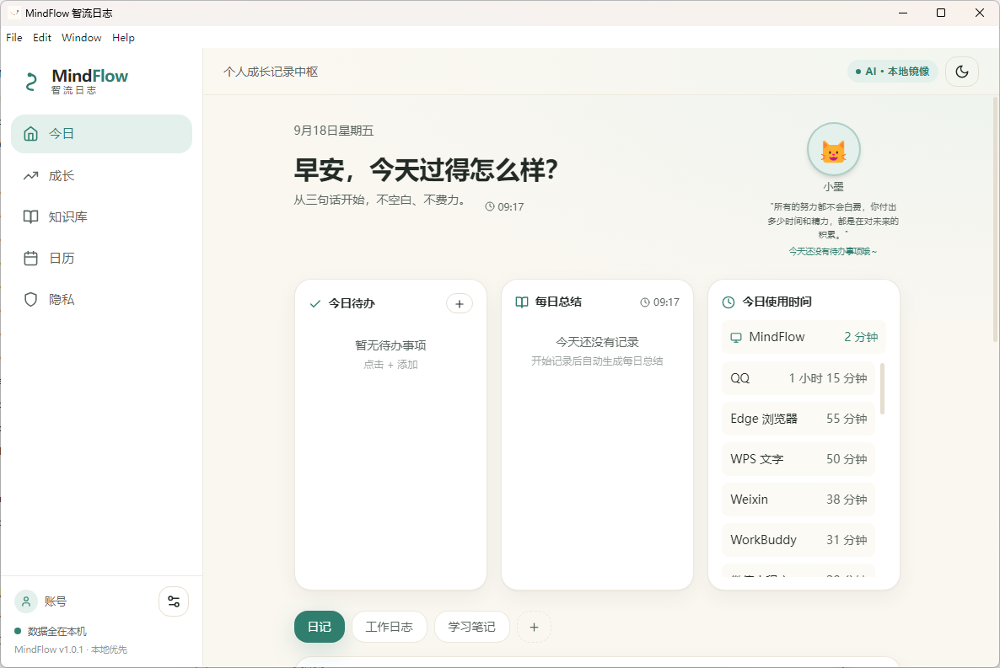
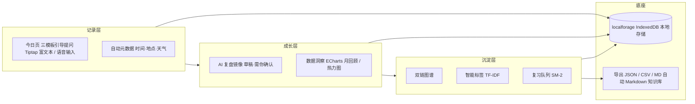
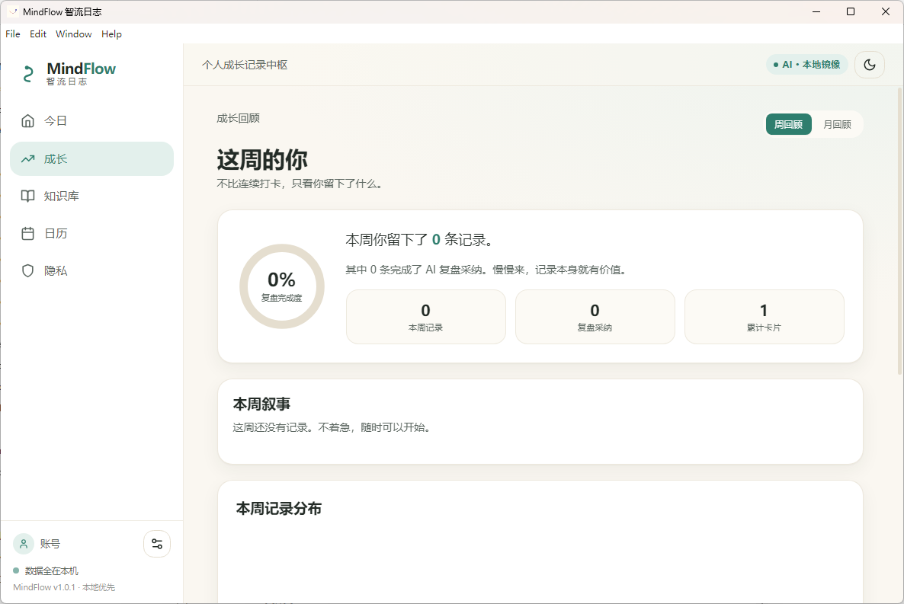
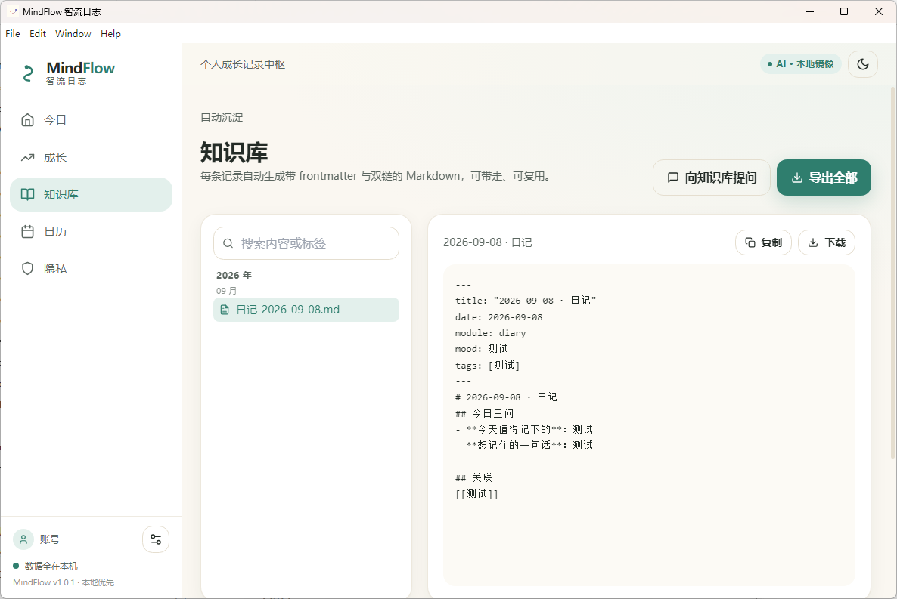
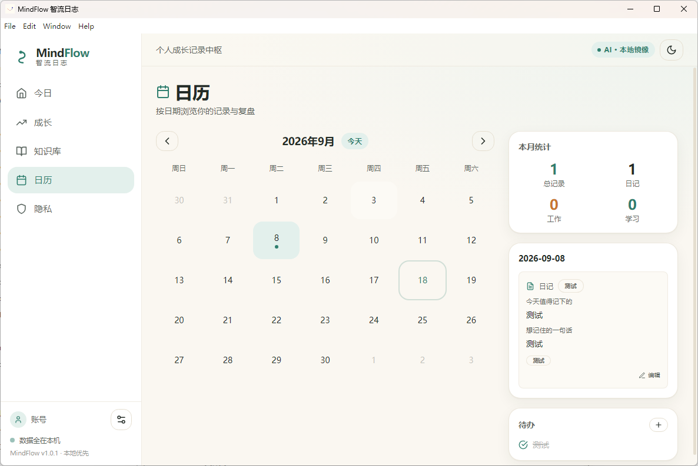
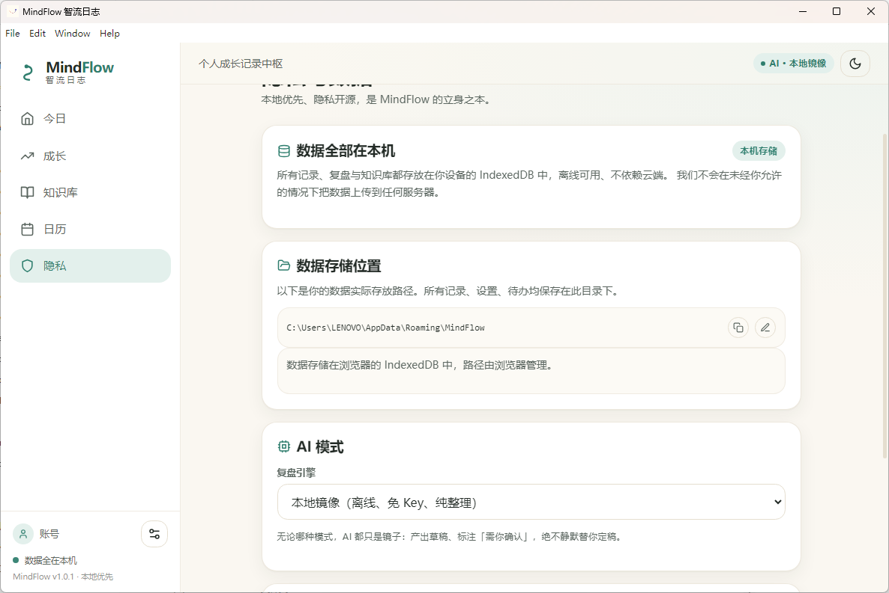
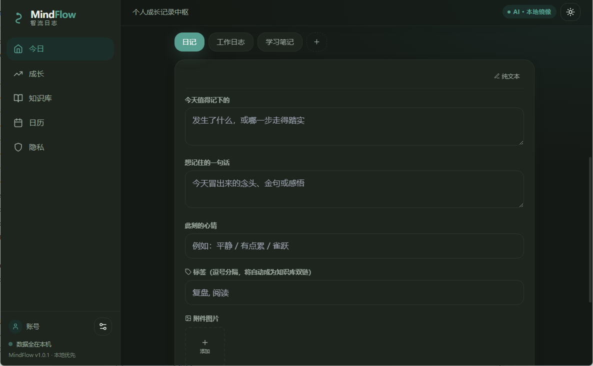

<div align="center">
  
</div>

# MindFlow 智流日志

<div align="center">

**本地优先、AI 驱动、注重隐私的个人成长记录中枢**

简体中文 | [English](./README.en.md)

</div>

> 记录、复盘、沉淀，三位一体。


[](https://github.com/YUDongLin1/MindFlow/actions/workflows/ci.yml)

**MindFlow 智流日志** 是一款基于 **Vue 3** + **Vite** + **Electron** 构建的 **AI 个人成长记录应用**，基于开源项目 [MoodsNote 晨暮日记](https://github.com/PStarH/MoodNotes)（AGPL-3.0）二次开发。它坚持**本地优先（Local-First）**的设计理念：日记、工作日志、学习笔记三合一记录，配合 AI 复盘与自动生成的 Markdown 知识库，帮助你建立「记录 → 复盘 → 沉淀」的成长闭环。数据 100% 存储在本地，不上传、不训练。

> 这是一个**产品驱动**的项目：从用户痛点出发定义功能，用埋点与 A/B 实验驱动迭代，最终交付可安装的完整产品。详见 [我的职责与产出](#我的职责与产出)。

<div align="center">
  
</div>

## 目录

- [为什么做这个项目](#为什么做这个项目)
- [目标用户与场景](#目标用户与场景)
- [产品架构](#产品架构)
- [AI 能力设计](#ai-能力设计)
- [核心指标与验证](#核心指标与验证)
- [我的职责与产出](#我的职责与产出)
- [核心功能](#核心功能)
- [界面预览](#界面预览)
- [技术栈](#技术栈)
- [快速开始](#快速开始)
- [快捷键](#快捷键)
- [项目结构](#项目结构)
- [测试](#测试)
- [路线图](#路线图)
- [许可证](#许可证)

## 为什么做这个项目

记录工具很多，但「记了不复盘、复盘不沉淀、沉淀难复用」的断点普遍存在：

| 痛点 | 现状 | MindFlow 的回答 |
|------|------|-----------------|
| 日记、工作日志、学习笔记分散在 3+ 个 App | 上下文割裂，回顾成本高 | 三模块一体化记录，统一时间线与知识库 |
| 写完就归档，从未产生「第二次阅读」 | 记录变成沉没成本 | AI 复盘 + 双链图谱 + SM-2 间隔重复复习队列，让旧记录主动「回来」 |
| 云端 AI 笔记的隐私焦虑 | 原文被上传、被训练 | Local-First 架构：数据 100% 留在本机，AI 可选离线镜像模式，断网全功能可用 |
| AI 输出「一本正经地编造」 | 用户不敢采信 | 溯源校验：`checkProvenance` 逐段回溯原文，覆盖率不达标即标红 |

## 目标用户与场景

- **研究生 / 自学者**：文献笔记与实验日志分散，需要「学习三维度」模板与知识库问答串联旧笔记
- **职场新人**：日报周报重复劳动，需要一键工作周报与「上周卡点 → 本周计划」自动衔接
- **注重隐私的个人成长者**：愿意记录真实心绪，但拒绝原文上云

## 产品架构

核心闭环：**记录 → AI 复盘 → 知识沉淀 → 复习回访**



## AI 能力设计

**三模式渐进可用，隐私与智能由用户自选**：

| 模式 | 原理 | 适用人群 |
|------|------|----------|
| `local` | 规则引擎离线生成「镜像式复盘」，免 Key、免网络 | 默认模式，隐私敏感用户 |
| `byok` | 用户自带 Key，接入 Ollama 本地模型或任意 OpenAI 兼容 API | 想要真 AI 的用户，Key 仅存本机 |
| `cloud` | 订阅云模型端点（预留） | 后续商业化 |

**四条不可协商的产品红线**（已写入代码注释与测试用例）：

1. **绝不编造** —— AI 只基于用户原文组织语言，禁止补写事实
2. **绝不静默定稿** —— 所有输出标注「草稿·需你确认」，采纳 / 丢弃 / 还原三态齐备，AI 是镜子不是写手
3. **可溯源** —— `checkProvenance` 对每个输出片段回溯原文，覆盖率不达标即标红
4. **优雅降级** —— 网络 / 解析失败自动回退本地镜像（`source='local-fallback'`），功能不中断

> 这套红线的本质是**信任设计**：AI 记录工具一旦编造一次，用户就再也不会打开它。

## 核心指标与验证

| 指标 | 结果 | 说明 |
|------|------|------|
| 单元测试 | **32 / 32 通过** | Vitest + happy-dom，覆盖 AI 客户端、行为埋点、A/B 实验、工作周报、日志数据层等核心链路（`npx vitest run`） |
| 交付完整性 | **Windows NSIS 安装包 87.21 MB** | 安装 / 启动 / 卸载全链路手工回归通过 |
| 迭代决策支撑 | **23 类行为埋点 + 3 组 A/B 实验** | 独立存储实例，与用户数据隔离 |
| 隐私合规 | **导出自动脱敏 AI Key** | JSON 完整备份不含密钥 |

> 冷启动耗时、大规模数据导出耗时等指标仍在实测中，欢迎提 Issue 交流。

## 我的职责与产出

本项目基于 [MoodsNote（PStarH/MoodNotes）](https://github.com/PStarH/MoodNotes)（AGPL-3.0）二次开发，以下为**我的独立产出**：

| 模块 | 上游基线 | 我的改动 | 价值 |
|------|----------|----------|------|
| 产品定位 | 单一心情日记 | 重新定义为「工作 / 学习 / 日记」三合一成长中枢 | 从记录工具升级为成长系统 |
| 界面架构 | 旧版仪表盘 | 全量重设计「今日 / 成长 / 知识库 / 日历 / 隐私 / 设置」六视图 + 设计系统「纸·墨·流」 | 信息密度与一致性显著提升 |
| 状态管理 | Vuex 4 | 迁移至 Pinia（保留兼容层），统一 localforage 配置 | 可维护性，为多端同步铺路 |
| 编辑器 | Quill | 迁移至 Tiptap，富文本 / 纯文本一键切换 | 扩展性更好，原生支持双链语法 |
| 可视化 | Chart.js | 迁移至 ECharts，新增月度热力图 / 模块分布 / 标签 Top10 | 洞察密度提升 |
| AI 复盘 | 无 | 设计 local / byok / cloud 三模式 + 四条产品红线 + 溯源校验 | 差异化核心，见 [AI 能力设计](#ai-能力设计) |
| 知识沉淀 | 无 | 双链图谱 + 智能标签 + SM-2 间隔重复复习队列 + 语音输入 | 让记录产生复利 |
| 桌面体验 | 无 | 系统托盘常驻、全局快捷键体系、日历待办联动、桌面宠物 | 日活留存抓手 |
| 数据能力 | 基础备份 | 5 格式无损导入 + 冲突预检、JSON / CSV / MD 导出、导出脱敏 | 迁移无门槛，隐私兜底 |
| 质量与交付 | 无 CI 产物 | 32 个单元测试、CI 工作流、Windows 打包链路（EXE 资源补写、沙箱缺陷修复） | 可安装的完整产品 |

## 核心功能

- 三模块记录
  - 日记 / 工作日志 / 学习笔记三种模板各有引导（日记三问 / 工作三字段 / 学习三维度）
  - 富文本编辑器（Tiptap），支持富文本 / 纯文本一键切换
  - 语音输入（Web Speech API 中文识别）、智能标签推荐（TF-IDF 分词）
  - 时间 / 位置 / 天气元数据自动记录，支持自定义记录模块

- AI 复盘
  - 三模式 AI：本地镜像（零网络）/ 自带 Key（OpenAI 兼容 + Ollama）/ 云端
  - 四段式结构化复盘（成果 / 收获 / 改进 / 行动），12 秒超时保护
  - 溯源校验防止幻觉内容，「草稿·需你确认」，采纳 / 丢弃 / 还原三态齐备，全程审计日志
  - AI 连接测试（设置 / 隐私页，models 端点探测，15 秒超时）

- 追踪与视图
  - 心情 / 精力 / 压力追踪，ECharts 可视化
  - 每日待办，同步显示于成长页与日历页
  - 日历月视图浏览记录，每日总结卡片

- 知识库
  - 每条记录自动生成带 frontmatter + 双链 `[[ ]]` 的 Markdown，按年月组织
  - Canvas 力导向知识图谱、间隔重复复习（SM-2）、全文检索与 AI 问答

- 数据与隐私
  - 本地存储（IndexedDB / LocalForage），离线可用，存储位置可配置
  - 导出 JSON 完整备份 / CSV / Markdown；导入 5 种格式（JSON/TXT/CSV/Markdown/HTML，按内容自动识别），冲突预检
  - 桌面宠物陪伴（预设猫 / 狗 / 植物 + 自定义上传）

## 界面预览

<div align="center">
<table>
  <tr>
    <td align="center" width="50%">
      
      <br /><sub><b>今日</b> · 三模板引导记录 + AI 复盘草稿</sub>
    </td>
    <td align="center" width="50%">
      
      <br /><sub><b>成长</b> · 月统计 / 热力图 / 模块分布 / 标签 Top10</sub>
    </td>
  </tr>
  <tr>
    <td align="center" width="50%">
      
      <br /><sub><b>知识库</b> · 双链图谱 + SM-2 复习队列 + AI 问答</sub>
    </td>
    <td align="center" width="50%">
      
      <br /><sub><b>日历</b> · 月视图浏览 + 未来待办到日自动同步</sub>
    </td>
  </tr>
  <tr>
    <td align="center" width="50%">
      
      <br /><sub><b>隐私</b> · 本地存储路径可见可改 + 导出脱敏</sub>
    </td>
    <td align="center" width="50%">
      
      <br /><sub><b>深色模式</b> · 设计系统「纸·墨·流」明暗双主题</sub>
    </td>
  </tr>
</table>
</div>

## 技术栈

- 前端：Vue 3、TypeScript、Vite、TailwindCSS、Vue Router、Vue I18n
- 状态管理：Pinia（主）+ Vuex 兼容层
- 富文本：Tiptap（ProseMirror 驱动）
- 可视化：ECharts + vue-echarts
- 数据：LocalForage（IndexedDB 持久化）
- 桌面端：Electron 33（上下文隔离、安全预加载桥），electron-builder 打包
- 测试：Vitest（happy-dom）

## 快速开始

### 直接下载

👉 **[MindFlow-Setup-1.0.1-x64.exe](https://github.com/YUDongLin1/MindFlow/releases/download/v1.0.1/MindFlow-Setup-1.0.1-x64.exe)**（Windows NSIS 安装版，约 78 MB）

| 平台 | 产物 |
|------|------|
| Windows | `MindFlow-Setup-1.0.1-x64.exe`（安装版）、`MindFlow.1.0.1.exe`（便携版） |
| macOS | `MindFlow-1.0.1-universal.dmg`（Intel + Apple Silicon，未签名，首次启动需在「系统设置 → 隐私与安全性」允许） |
| Linux | `MindFlow-1.0.1.AppImage`、`mindflow_1.0.1_amd64.deb` |

全部产物见 [Releases](https://github.com/YUDongLin1/MindFlow/releases)，由 GitHub Actions 在 tag 推送时自动构建并发布。

### 从源码运行

环境要求：Node.js 18+，支持 Windows / macOS / Linux。

```bash
# 1. 安装依赖
npm install

# 2. 开发模式（Vite + Electron 热重载）
npm run dev
```

构建与打包：

```bash
# 生产构建（前端 + Electron TypeScript 编译）
npm run build

# 打包 Windows 应用（产物输出至 dist-electron/）
npm run package:win

# 类型检查
npm run type-check
```

Windows 打包产物：`MindFlow-Setup-1.0.1-x64.exe`（NSIS 安装版）与 `MindFlow 1.0.1.exe`（便携版）。打包配置以 `electron-builder-override.json` 为唯一配置源，一条命令完成：`powershell -NoProfile -ExecutionPolicy Bypass -File scripts\build-win.ps1`。

## 快捷键

| 快捷键 | 功能 | 作用域 |
|--------|------|--------|
| `Ctrl + N` | 新建记录（跳转「今日」页） | 全局 |
| `Ctrl + F` | 全局搜索（跳转知识库并聚焦搜索框） | 全局 |
| `Ctrl + ,` | 打开设置 | 全局 |
| `Ctrl + S` | 保存当前记录 | 今日页 |
| `Ctrl + E` | 切换富文本 / 纯文本 | 今日页 |
| `Ctrl + D` | 插入当前日期 | 今日页（纯文本模式） |
| `Ctrl + L` | 插入双链 `[[]]` | 今日页（纯文本模式） |
| `Ctrl + Shift + A` | 触发 AI 复盘 | 今日页 |

## 项目结构

```
.
├── electron/          # Electron 主进程（main.ts）与预加载脚本（preload.ts）
├── src/
│   ├── views/         # 6 个路由视图：今日 / 成长 / 知识库 / 日历 / 隐私 / 设置
│   ├── components/    # 43 个功能组件
│   ├── services/      # 13 个服务模块（AI 客户端、导入导出、周报等）
│   ├── stores/        # 6 个 Pinia stores（journal/todo/settings/habits/summaries/pet）
│   ├── composables/   # 15 个组合式函数（快捷键、搜索、主题等）
│   ├── store/         # Vuex 兼容层（旧组件使用）
│   ├── i18n/          # 多语言（zh / en）
│   ├── router/        # 路由
│   └── utils/         # 工具方法（日期、字数、元信息等）
├── vite.config.ts
├── vitest.config.ts
└── package.json
```

## 测试

```bash
# 运行单元测试（Vitest + happy-dom）
npx vitest run
```

## 路线图

- [ ] 端到端加密（E2EE）多端同步
- [ ] 移动端（Capacitor）适配
- [ ] AI 复盘 Prompt 配置化与效果评测集

## 许可证

本项目采用 **AGPL-3.0** 许可证发布，详见 [LICENSE](./LICENSE)。

本项目基于开源项目 [MoodsNote 晨暮日记](https://github.com/PStarH/MoodNotes)（原作者 [@PStarH](https://github.com/PStarH)，AGPL-3.0）二次开发，感谢原项目打下的坚实基础。依据 AGPL-3.0，本项目所有修改与新增部分同样以 AGPL-3.0 协议开源，主要改动范围见 [我的职责与产出](#我的职责与产出)。
