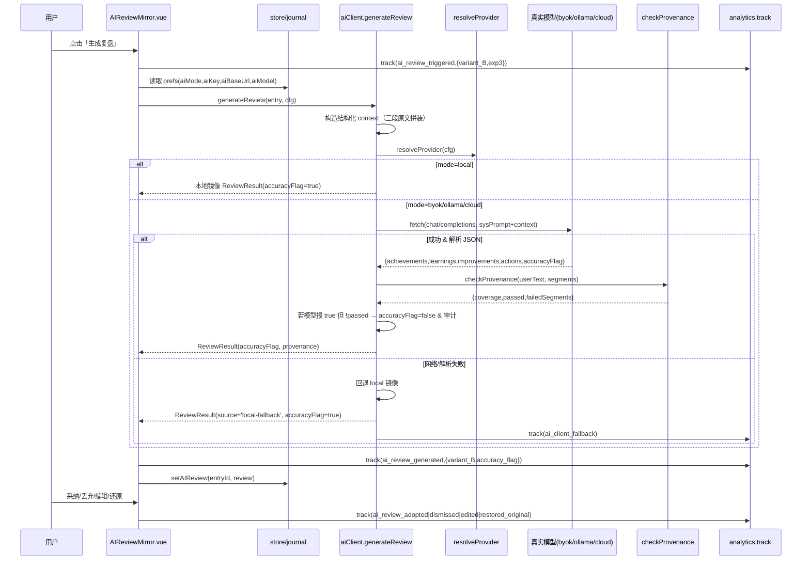
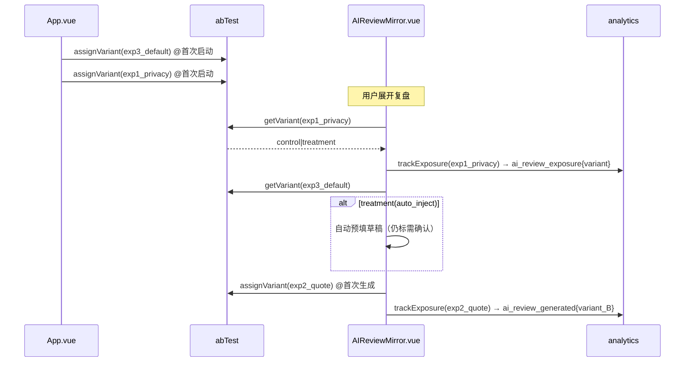
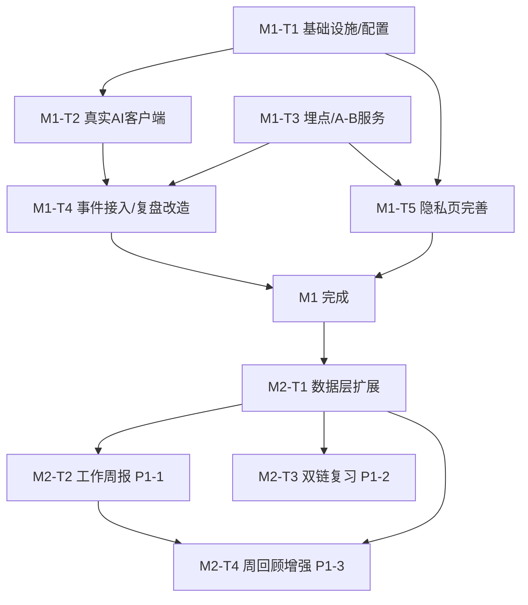

# MindFlow 智流日志 · 统一实现设计文档（M1 + M2-core）

> 架构师：高见远（software-architect）
> 日期：2026-08-01
> 范围：M1 收尾（真实 AI 客户端 + CSP 放开 + 埋点 / A·B）+ M2 结构化管理核心（P1-1 / P1-2 / P1-3）
> 底座：MindFlow v1.0.5 二次开发 · Vue 3.5 + Vite 5 + Tailwind 3.4 + Vuex 4 + localforage + Electron 33
> 设计系统：「纸·墨·流」 · AI 红线：镜子式、可溯源、绝不替用户定稿

---

## 1. 实现方案 + 框架选型

### 1.1 总体原则

- **零新增运行时依赖**：AI 调用用浏览器内置 `fetch`（Electron 渲染进程可用）；埋点 / A/B 复用 `localforage`；严格不引入 axios 之外的网络库（axios 已装但本项目建议用 `fetch`，避免额外体积与包管理风险）。
- **不触碰废弃代码**：`Analytics.vue` / `Settings.vue` / `DaySummary.vue` / `TabNavigation.vue` 等一律不动，新功能只在 `Homepage / AIReviewMirror / Growth / Knowledge / Privacy` 与新增 `services/*` 上落地。
- **红线优先**：AI 任何输出必须标注「草稿·需你确认」，采纳 / 丢弃 / 还原三态齐备；`accuracyFlag` 由客户端可溯源校验兜底，模型自报 true 但校验不过则强制 false 并打审计。
- **视觉一致性**：新增语义色（如需）一律在 `:root` 与 `.theme-dark` 双写 `rgb(var(--x) / <alpha-value>)` 通道变量。

### 1.2 AI 真实客户端（替代 `REAL_LLM_NOT_WIRED`）

| 能力 | 选型 | 说明 |
|------|------|------|
| 网络请求 | 原生 `fetch`（不引 axios） | Electron 渲染进程默认可用，无任何新增依赖 |
| 协议 | OpenAI Chat Completions 格式 / Ollama `/api/chat` | 两种 provider 同一 `byok` 模式内按 host 自动识别 |
| 解析 | `res.json()` + 严格字段校验 | 解析失败即回退本地镜像，保证「镜子」永不空窗 |
| 可溯源 | 客户端 shingle 覆盖率校验 | 见 §7，独立于模型自报 `accuracyFlag` |

- **`byok`（OpenAI 兼容）**：`POST ${aiBaseUrl}/chat/completions`，Header `Authorization: Bearer ${apiKey}`，body `{model, messages, response_format:{type:'json_object'}}`。`aiBaseUrl` 缺省回退 `https://api.openai.com/v1`，`aiModel` 缺省 `gpt-4o-mini`。
- **本地 Ollama**：当 `aiBaseUrl` 指向本机（`localhost`/`127.0.0.1`，端口 11434）时自动切到 `POST http://localhost:11434/api/chat`，body `{model, messages, stream:false, format:'json'}`；无需 `apiKey`。
- **`cloud`（MindFlow 订阅模型）**：用常量 `import.meta.env.VITE_MINDFLOW_LLM_ENDPOINT`（`.env` 注入，仅占位）。未配置（空串）时抛 `CLOUD_LLM_NOT_CONFIGURED`，UI 给出清晰引导「云模型尚未在本地配置，可改用本地镜像或自带 Key」。
- **System Prompt（硬约束）**：只基于给定文本，返回严格 JSON `{achievements, learnings, improvements, actions, accuracyFlag}`；不得编造、不得润色定稿；每段须能回溯到用户原文；输出前必须声明「草稿·需你确认」。
- **回退**：真实调用抛网络错误 / 解析错误 / 不支持模式时，调用既有 local 镜像生成，并置 `source:'local-fallback'`、`accuracyFlag:true`（本地为纯引用，天然可溯源）、审计一条 `ai_client_fallback`。

### 1.3 埋点（analytics.ts）

- `track(name, props)` → 写入 `localforage('mindflow:analytics')`，数组环形截断（上限 5000 条，超出丢弃最旧）。
- 事件名常量集中定义（见 §7），覆盖事件字典 v0.2：核心循环 / 连接器 / 实验 / 护栏 四类。
- 派生指标函数：`activationRate()`（首条记录 / 启动）、`aiTriggerRate()`（周去重 `ai_review_triggered`/WAU）、`war()`（周去重 `[entry_created AND (ai_review_triggered|link_created|history_reviewed|weekly_review_generated)]`）、`crashRate()`（`app_crash`/会话数）。
- **MVP 仅本机存储，不联网**；代码中以注释标明未来 `cloud` 模式可选批量上报，接口预留 `flush()` 占位。

### 1.4 A/B 实验框架（abTest.ts）

- `assignVariant(expId)` → 50/50 随机并**粘性**写入 `localforage('mindflow:ab')`（map：`expId→'control'|'treatment'`）。
- `getVariant(expId)` 读粘性值；`trackExposure(expId)` 调 `analytics.track('ai_review_exposure', {exp, variant})`。
- 三个实验定义（见 §3 `ABExperiment`）：
  - **Exp1 隐私标识**：control=不展示；treatment=在触发/曝光 AI 复盘处展示「本地·不训练·可关」徽标。
  - **Exp2 引用保留 vs 润色**：`variant_B ∈ {quote_preserving, polished}`；treatment 允许轻度结构整理但**仍须通过可溯源校验**（accuracyFlag 不可因润色而 false 通过）。
  - **Exp3 默认关 vs 默认注入**：control=AI 需手动触发；treatment=首次进入即预填草稿（仍标「需你确认」，仍可还原/丢弃）。

### 1.5 依赖包列表结论

**新增运行时依赖 = 0。** 全部使用既有栈（fetch / localforage / Vuex）。仅新增 `.env.example` 承载 `VITE_MINDFLOW_LLM_ENDPOINT` 占位，无 package 变更。

---

## 2. 文件清单（相对路径）

### M1 新增 / 修改

| 文件 | 动作 | 说明 |
|------|------|------|
| `src/services/aiClient.ts` | 重写 | 真实客户端（byok/ollama/cloud）+ provenance 校验 + 回退 |
| `src/services/analytics.ts` | 新增 | 埋点服务 + EVENTS 常量 + 派生指标 |
| `src/services/abTest.ts` | 新增 | A/B 粘性分配 + 曝光 |
| `index.html` | 修改 | CSP `connect-src` 放开外网 |
| `.env.example` | 新增 | `VITE_MINDFLOW_LLM_ENDPOINT` 占位 |
| `src/store/journal.ts` | 修改 | `JournalPrefs` 增 `aiBaseUrl?`/`aiModel?`；`AIConfig` 推导 |
| `src/views/Privacy.vue` | 修改 | BaseURL / Model 输入、cloud 未配置清晰报错、Exp1 标识位数据 |
| `src/components/AIReviewMirror.vue` | 修改 | 接真实客户端、variant_B、fallback UI、三态事件埋点 |
| `src/views/Homepage.vue` | 修改 | `entry_created` / `first_entry_created` / `link_created` 事件 |
| `src/views/Growth.vue` | 修改 | `weekly_review_viewed` 预埋（M2 增强） |
| `src/App.vue` + `src/components/ErrorBoundary.vue` | 修改 | 全局崩溃捕获 → `app_crash` 事件 |

### M2 新增 / 修改

| 文件 | 动作 | 说明 |
|------|------|------|
| `src/services/weeklyReport.ts` | 新增 | 本周 WORK 条目的 did/stuck/next 聚合为 MD 周报 |
| `src/store/journal.ts` | 修改 | `JournalEntry` 增 `reviewMark?` / `wikiLinks?`；`addEntry` 提取 study `[[ ]]` |
| `src/views/Growth.vue` | 修改 | P1-3 周回顾增强（模块分布 / 标签 Top / 叙事 / 周报 CTA / `weekly_review_generated`） |
| `src/components/WeeklyReportModal.vue` | 新增 | 周报预览 + 复制 / 下载（复用 markdownExport） |
| `src/views/Knowledge.vue` | 修改 | P1-2 复习队列 + `wikiLinks` 展示 |
| `src/components/ReviewQueue.vue` | 新增 | 复习队列卡片（按 `reviewMark` / `wikiLinks` 聚合） |

---

## 3. 数据结构与接口

### 3.1 AI 客户端（aiClient.ts）

```ts
import type { JournalEntry, AIReviewSegment, AIMode } from '@/store/journal'

export interface AIConfig {
  mode: AIMode                 // 'local' | 'byok' | 'cloud'
  apiKey?: string
  aiBaseUrl?: string           // 新增：byok/ollama 端点（缺省回退 openai）
  aiModel?: string             // 新增：模型名（缺省 gpt-4o-mini / ollama 默认）
}

export interface ProvenanceCheck {
  coverage: number             // 0..1， shingles 覆盖率
  passed: boolean              // 是否可溯源
  checkedAt: string
  failedSegments: string[]     // 未通过校验的段落 key
}

export interface ReviewResult {
  draft: AIReviewSegment       // { achievements, learnings, improvements, actions }
  accuracyFlag: boolean        // 经客户端校验后的最终值
  note: string                 // 透传给 UI 的说明
  source: AIMode | 'local-fallback'
  provenance?: ProvenanceCheck
}

export async function generateReview(entry: JournalEntry, cfg: AIConfig): Promise<ReviewResult>
// 内部：构造 context → resolveProvider → fetch → 解析 JSON → checkProvenance → 回退 local
```

### 3.2 埋点（analytics.ts）

```ts
export const EVENTS = {
  SIGNUP: 'signup',
  FIRST_ENTRY_CREATED: 'first_entry_created',
  ENTRY_CREATED: 'entry_created',
  LINK_CREATED: 'link_created',
  HISTORY_REVIEWED: 'history_reviewed',
  SEARCH_QUERY: 'search_query',
  AI_REVIEW_EXPOSURE: 'ai_review_exposure',
  AI_REVIEW_TRIGGERED: 'ai_review_triggered',
  AI_REVIEW_GENERATED: 'ai_review_generated',
  AI_REVIEW_VIEWED: 'ai_review_viewed',
  AI_REVIEW_ADOPTED: 'ai_review_adopted',
  AI_REVIEW_DISMISSED: 'ai_review_dismissed',
  AI_REVIEW_EDITED: 'ai_review_edited',
  AI_REVIEW_RESTORED_ORIGINAL: 'ai_review_restored_original',
  WEEKLY_REVIEW_GENERATED: 'weekly_review_generated',
  WEEKLY_REVIEW_VIEWED: 'weekly_review_viewed',
  EXPORT_TRIGGERED: 'export_triggered',
  APP_CRASH: 'app_crash',
} as const

export type AnalyticsEventName = typeof EVENTS[keyof typeof EVENTS]

export interface AnalyticsEvent {
  name: AnalyticsEventName
  props?: Record<string, unknown>
  ts: string
  sessionId: string
}

export function track(name: AnalyticsEventName, props?: Record<string, unknown>): Promise<void>
export function activationRate(): Promise<number>
export function aiTriggerRate(): Promise<number>
export function war(): Promise<number>
export function crashRate(): Promise<number>
// 注释预留：export function flush(): Promise<void>  // 未来 cloud 批量上报
```

### 3.3 A/B（abTest.ts）

```ts
export type ExpId = 'exp1_privacy' | 'exp2_quote' | 'exp3_default'
export type Variant = 'control' | 'treatment'

export interface ABExperiment {
  id: ExpId
  control: string
  treatment: string
  description: string
  exposureEvent: AnalyticsEventName   // 何时记曝光
}

export const EXPERIMENTS: Record<ExpId, ABExperiment> = {
  exp1_privacy: {
    id: 'exp1_privacy',
    control: 'no_badge',
    treatment: 'show_privacy_badge',
    description: '入口展示本地/加密/不训练标识 vs 无',
    exposureEvent: EVENTS.AI_REVIEW_EXPOSURE,
  },
  exp2_quote: {
    id: 'exp2_quote',
    control: 'quote_preserving',
    treatment: 'polished',
    description: '保留原话+引用 vs 轻度润色（仍需过溯源校验）',
    exposureEvent: EVENTS.AI_REVIEW_GENERATED,
  },
  exp3_default: {
    id: 'exp3_default',
    control: 'opt_in',            // 默认关，手动触发
    treatment: 'auto_inject',     // 默认预填草稿（仍须确认）
    description: '默认关+可编辑还原 vs 默认注入草稿',
    exposureEvent: EVENTS.AI_REVIEW_EXPOSURE,
  },
}

export function assignVariant(expId: ExpId): Variant
export function getVariant(expId: ExpId): Variant | null
export function trackExposure(expId: ExpId): Promise<void>
```

### 3.4 数据模型扩展（journal.ts）

```ts
// JournalPrefs 增加字段
export interface JournalPrefs {
  aiMode: AIMode
  aiKey: string
  e2eeEnabled: boolean
  aiBaseUrl?: string   // 新增
  aiModel?: string     // 新增
}

// JournalEntry 增加字段
export interface JournalEntry {
  id: string
  date: string
  module: ModuleType
  mood?: string
  prompts: JournalPrompt[]
  title?: string
  tags: string[]
  links: string[]
  reviewMark?: boolean      // 新增：学习笔记复习标记
  wikiLinks?: string[]      // 新增：从学习 prompt 提取的 [[x]]
  createdAt: string
  updatedAt: string
  review?: AIReview
}
```

### 3.5 周报聚合（weeklyReport.ts）

```ts
export interface WeeklyReportInput {
  entries: JournalEntry[]      // 本周 WORK 条目
  weekStart: string            // YYYY-MM-DD（周一）
}

export interface WeeklyReportOutput {
  markdown: string
  daysCovered: number
  counts: { did: number; stuck: number; next: number }
  range: { start: string; end: string }
}

export function generateWeeklyReport(input: WeeklyReportInput): WeeklyReportOutput
// 复用 markdownExport.downloadMarkdown / copyMarkdown 做复制下载
```

---

## 4. 程序调用流程

### 4.1 AI 复盘链路（generateReview 内部）



### 4.2 埋点事件触发点（各视图）

| 事件 | 触发位置 | 时机 |
|------|----------|------|
| `signup` | `App.vue` | 首次启动（代理注册，见 §8） |
| `first_entry_created` | `Homepage.vue` | 用户首条记录落库（24h 内 → 激活） |
| `entry_created` | `Homepage.vue` | 每次保存，`props:{module,len,source}` |
| `link_created` | `Homepage.vue` | 标签/双链生成时 |
| `ai_review_exposure` | `AIReviewMirror.vue` | 复盘区首次展开（Exp1/Exp3 曝光） |
| `ai_review_triggered` | `AIReviewMirror.vue` | 点击「生成复盘」 |
| `ai_review_generated` | `AIReviewMirror.vue` | 收到 ReviewResult（Exp2 曝光） |
| `ai_review_viewed` | `AIReviewMirror.vue` | 草稿渲染完成 |
| `ai_review_adopted/dismissed/edited/restored_original` | `AIReviewMirror.vue` | 对应三态/编辑动作 |
| `weekly_review_generated` | `Growth.vue` / `WeeklyReportModal.vue` | 生成周报 |
| `weekly_review_viewed` | `Growth.vue` | 周回顾面板进入视图 |
| `export_triggered` | `Knowledge.vue` / `WeeklyReportModal.vue` | 导出 MD |
| `app_crash` | `App.vue` + `ErrorBoundary.vue` | 全局 error / unhandledrejection / onErrorCaptured |

### 4.3 A/B variant 分配与曝光时机



---

## 5. 有序任务列表（按实现顺序 + 依赖）

> P0 = 发布硬门槛相关；P1 = M2 结构化管理。

### M1 阶段

- **M1-T1** 基础设施与配置扩展（P0）
  - 源文件：`src/store/journal.ts`、`index.html`、`.env.example`
  - 内容：`JournalPrefs` 增 `aiBaseUrl?`/`aiModel?`；CSP `connect-src` 放开；新增 `.env.example` 承载 `VITE_MINDFLOW_LLM_ENDPOINT`。
  - 依赖：无
  - 优先级：P0
- **M1-T2** 真实 AI 客户端（P0）
  - 源文件：`src/services/aiClient.ts`
  - 内容：重写 `generateReview` 支持 byok/ollama/cloud；`resolveProvider`；`checkProvenance`；回退 local；错误码 `CLOUD_LLM_NOT_CONFIGURED`。
  - 依赖：M1-T1
  - 优先级：P0
- **M1-T3** 埋点与 A/B 服务（P0）
  - 源文件：`src/services/analytics.ts`、`src/services/abTest.ts`
  - 内容：`track` + 派生指标；`EXPERIMENTS` 三实验；粘性分配与曝光。
  - 依赖：无（可与 M1-T1 并行）
  - 优先级：P0
- **M1-T4** 事件接入与复盘组件改造（P0）
  - 源文件：`src/components/AIReviewMirror.vue`、`src/views/Homepage.vue`、`src/App.vue`、`src/components/ErrorBoundary.vue`
  - 内容：AIReviewMirror 接真实客户端 + variant_B + fallback UI + 三态事件；Homepage 触发 entry/link 事件；全局崩溃 → `app_crash`。
  - 依赖：M1-T2、M1-T3
  - 优先级：P0
- **M1-T5** 隐私页完善（P0）
  - 源文件：`src/views/Privacy.vue`
  - 内容：BaseURL / Model 输入与持久化；cloud 未配置清晰报错；Exp1 隐私标识位的展示开关逻辑。
  - 依赖：M1-T1、M1-T3
  - 优先级：P0

### M2 阶段（依赖 M1 全完成）

- **M2-T1** 数据层扩展（P1）
  - 源文件：`src/store/journal.ts`
  - 内容：`JournalEntry` 增 `reviewMark?`/`wikiLinks?`；`addEntry` 对 study 模块从 prompt 文本正则提取 `[[x]]` 写入 `wikiLinks`。
  - 依赖：无（独立，建议在 M1 后即可开始）
  - 优先级：P1
- **M2-T2** 工作周报（P1-1）
  - 源文件：`src/services/weeklyReport.ts`、`src/views/Growth.vue`、`src/components/WeeklyReportModal.vue`
  - 内容：聚合本周 WORK 条目 did/stuck/next 成 MD；Growth 加「生成本周工作周报」入口 + 预览模态（复制/下载）；触发 `weekly_review_generated`。
  - 依赖：M2-T1
  - 优先级：P1
- **M2-T3** 双链与复习队列（P1-2）
  - 源文件：`src/views/Knowledge.vue`、`src/components/ReviewQueue.vue`
  - 内容：Knowledge 展示 `wikiLinks`；复习队列按 `reviewMark`/`wikiLinks` 聚合，支持切换 `reviewMark`；保持「纸·墨·流」。
  - 依赖：M2-T1
  - 优先级：P1
- **M2-T4** 周回顾增强（P1-3）
  - 源文件：`src/views/Growth.vue`
  - 内容：模块分布、本周标签 Top、本地生成周回顾叙事、周报 CTA、进入即触发 `weekly_review_viewed`；保持「无打卡羞辱」基调。
  - 依赖：M2-T1、M2-T2
  - 优先级：P1

---

## 6. 依赖包列表

| 包 | 状态 | 用途 |
|----|------|------|
| （无新增） | — | 全部复用既有栈 |
| `fetch`（浏览器/Electron 内置） | 既有 | AI 真实调用 |
| `localforage` | 既有 | 埋点 / A/B 粘性存储 |
| `vue` / `vuex` / `tailwindcss` / `lucide-vue-next` | 既有 | UI 与状态 |

**结论：新增运行时依赖 = 0；无需修改 `package.json`。**

---

## 7. 共享知识（跨文件约定）

### 7.1 事件名常量集中定义位置

- 唯一真源：`src/services/analytics.ts` 的 `EVENTS` 对象与 `AnalyticsEventName` 联合类型。
- 所有视图只 `import { EVENTS } from '@/services/analytics'` 后引用 `EVENTS.XXX`，**禁止硬编码字符串**，避免拼写漂移。

### 7.2 variant 粘性存储 key

- `localforage('mindflow:ab')` → 对象：`{ exp1_privacy: 'control'|'treatment', exp2_quote: ..., exp3_default: ... }`。
- 分配即写、读取即命中；跨会话不变。`assignVariant` 内部用 `Math.random() < 0.5` 决定，写入前先 `getVariant` 避免重复分配。

### 7.3 埋点存储 key 与环形截断

- `localforage('mindflow:analytics')` → `AnalyticsEvent[]`。
- 上限 **5000 条**：`track` 写入前若 `length >= 5000` 则 `shift()` 丢弃最旧一条；写入后 `setItem`。
- sessionId：取 `localStorage('mindflow:session')`，缺失则生成 `crypto.randomUUID()` 并写入。

### 7.4 CSP 最终文案（index.html `connect-src`）

```html
<meta http-equiv="Content-Security-Policy" content="
  default-src 'self';
  script-src 'self' 'unsafe-eval';
  style-src 'self' 'unsafe-inline';
  img-src 'self' data: blob:;
  media-src 'self' blob:;
  connect-src 'self' https: http://localhost:* ws://localhost:*;
  font-src 'self';
  object-src 'none';
  base-uri 'self';
  form-action 'self';
" />
```

覆盖说明：
- `https:` → 通用 byok（OpenAI 等任意 https 端点）与 cloud endpoint。
- `http://localhost:*` 与 `ws://localhost:*` → 本地 Ollama（`http://localhost:11434/api/chat`，部分场景经 `ws` 流式）。
- `'self'` → 既有同源（IndexedDB 不直接走 CSP，但保留以防 Electron 主子进程通信）。

### 7.5 accuracyFlag 溯源校验算法（checkProvenance）

目标：判定模型输出**确实引用了用户已写原文**，避免幻觉 / 张冠李戴。模型自报 `accuracyFlag` 仅作参考，客户端独立复核，凡复核不通过一律 `false` 并审计。

```
输入：userText（entry 三段原文拼接，去空白）、segments（四段 AI 输出）
步骤：
1. sourceSet = shingles(userText, n=3)   // 所有 3 字滑动窗口，转小写，存入 Set
2. 对每段 seg：
   a. 若 seg 长度 < 8 或匹配占位模式（含「（」且含「明天/留白/不妨/慢慢来」）→ 标记 exempt（免于校验，视为善意提示）
   b. 否则 segSet = shingles(seg, 3)
        matched = |{ s ∈ segSet | s ∈ sourceSet }|
        coverage = matched / max(1, |segSet|)
   c. passed = (seg 为 exempt) || coverage >= 0.35
3. failedSegments = 所有 !passed 的段 key
4. 返回 { coverage: 平均覆盖率, passed: failedSegments 为空, failedSegments }
5. 决策：若模型自报 accuracyFlag=true 但 passed=false → 强制 accuracyFlag=false；记录审计 reason='provenance_mismatch'
```

设计取舍：阈值 **0.35** 偏保守（宁可判 false），因为镜子式复盘应高度贴合原文；占位句豁免避免误杀善意留白提示。`n=3` 对中文足够细粒度，且对轻微改写（同义替换）有一定容忍。

### 7.6 其他约定

- `AIMode` 三态不变；`aiBaseUrl`/`aiModel` 随 `journal` 命名空间持久化到 `mindflow:journal`，不另开 key。
- `signup`/`first_entry_created` 判定：当前无账号体系（本地优先），以「首次启动」代理 `signup`，「首条 entry 落库」代理 `first_entry_created`（见 §8 待确认）。
- 所有 `fetch` 调用统一 12s `AbortController` 超时，避免 Electron 渲染进程挂起。

---

## 8. 待明确事项（需主理人 / 用户拍板）

1. **Cloud endpoint 形态**：`VITE_MINDFLOW_LLM_ENDPOINT` 当前仅为占位常量（完整 chat/completions URL 还是 base？鉴权方式？）。若订阅未开通，引导文案与降级路径需产品确认。
2. **Exp2 润色上限**：treatment「polished」在红线（accuracyFlag 必须可溯源）下允许的最大改写程度，需用户研究 / 产品拍板，避免 provenance 校验把 treatment 全判 false 导致实验无意义。
3. **Ollama 是否独立 mode**：本设计在 `byok` 内按 host 探测切换 Ollama，是否要升为独立 `mode:'ollama'` 由主理人定。
4. **复习队列排程**：M2 P1-2 仅做「标记 + 队列展示」；间隔重复算法归 P2-3。是否 M2 就要最简单的「按标记时间升序」排程即可？
5. **`signup` 口径**：本地优先无注册流，`signup`/`first_entry_created` 以「首次启动 / 首条记录」代理是否合理？需与指标框架对齐，否则激活率计算口径偏差。
6. **WAR 闭环动作集**：本设计沿用事件字典 v0.2（含 `weekly_review_generated`）。若产品想把「周报生成」与「周回顾查看」都计入闭环，需在埋点侧明确，已在 `war()` 中按字典实现，待确认。

---

## 附录 · 任务依赖图



> 设计文档结束。所有类型与接口已对齐现有 `src/store/journal.ts`；实现阶段按 §5 任务顺序推进，确保「镜子」红线与「纸·墨·流」视觉一致。
